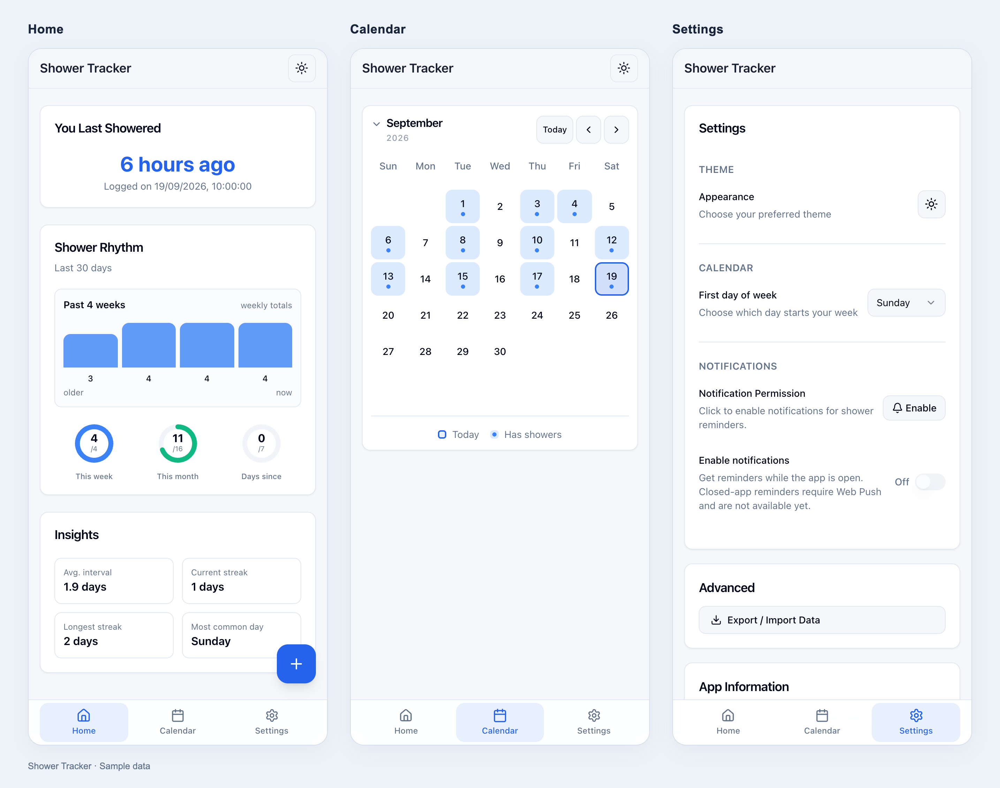

# Shower Tracker

A local-first PWA to log showers, review your history, and track personal goals. Data stays in your browser—no account or cloud sync.

[Open the app](https://d35p4c1t0.github.io/shower-tracker/)



*Home, Calendar, and Settings with sample data.*

- One-tap logging, calendar history, and shower frequency insights.
- Weekly and monthly goals, light and dark themes.
- Installable as a PWA with offline tracking. Reminders run only while the app is open.
- JSON backup and restore in Settings. Export a backup before clearing browser data.

## Tech stack & engineering

- **React 19 + TypeScript:** shared hooks and a storage service layer keep UI and persistence separate.
- **Tailwind CSS + Radix UI:** responsive layouts, light/dark themes, and reusable UI primitives.
- **IndexedDB via Dexie:** on-device history and settings, a localStorage fallback, and JSON backup/restore. No backend means no automatic sync across devices.
- **Vite + Workbox:** production builds, an installable PWA, and service worker caching for offline use.
- **Vitest + Testing Library + Playwright:** unit, component, and browser tests. GitHub Actions requires lint, unit tests, and blocking Chromium checks before deploying to Pages.

Start with [the home page](src/pages/HomePage.tsx), [storage services](src/lib/database-services/), or [browser tests](e2e/).

## Development

Use Node.js 22.12+ and pnpm 10.

```bash
pnpm install
pnpm dev
```

```bash
pnpm test          # Unit tests
pnpm test:e2e     # Playwright tests (install browsers first: pnpm exec playwright install)
pnpm lint
pnpm build        # Production build
pnpm preview      # Serve the build locally
```

## Deployment

GitHub Actions deploys to GitHub Pages on pushes to `main`. Use `pnpm build:github` for a Pages build, or `pnpm build` for other hosts. Output goes to `dist/`.

## License

[MIT](LICENSE)
